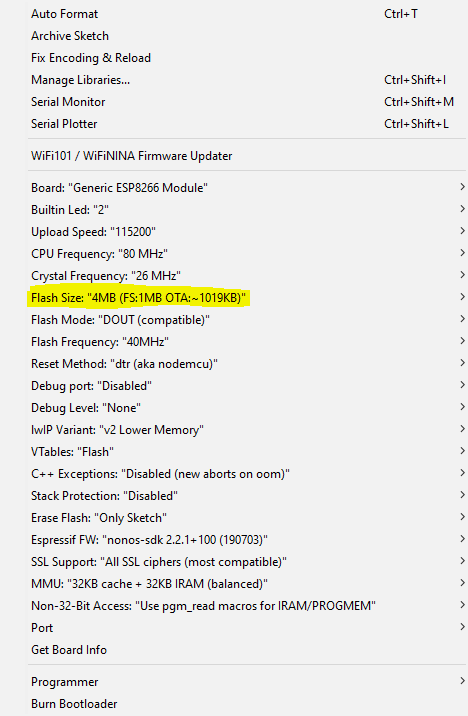

# kernelcon-2022-badge

the "kernelcon_watch_v4" firmware is the most up-to-date. its using the generic esp8622 core (rather than dstike). 

use Arduino IDE

libs and core needed:
- https://github.com/esp8266/Arduino
  * add as additional Boards Manager in preferences "https://arduino.esp8266.com/stable/package_esp8266com_index.json"
  * search "esp8622" and install via Boards Manager
- https://arduinojson.org/
  * to install via Library manager search for "ArduinoJson"

config when using the esp8266 core. use "Generic ESP8266 Module", and then change the highlighted. rest as default worked:

configuring WiFi:

the watch has hard-coded WiFi settings.  You need to update `wifi.h` prior to building the project.

Flashing

when flashing, you have to configure the TTY connecting your computer to the watch.  Configuration and settings will vary based on your hardware and operating system.  For instance in Linux, it might be connected on `/dev/ttyUSB0` and you may have ensure your user is added to the `tty` or `dialout` group with (which will require the user to log out and back in to taket effect): 

    sudo usermod -a -G tty <USERNAME>

original deauth software: https://github.com/SpacehuhnTech/esp8266_deauther  
